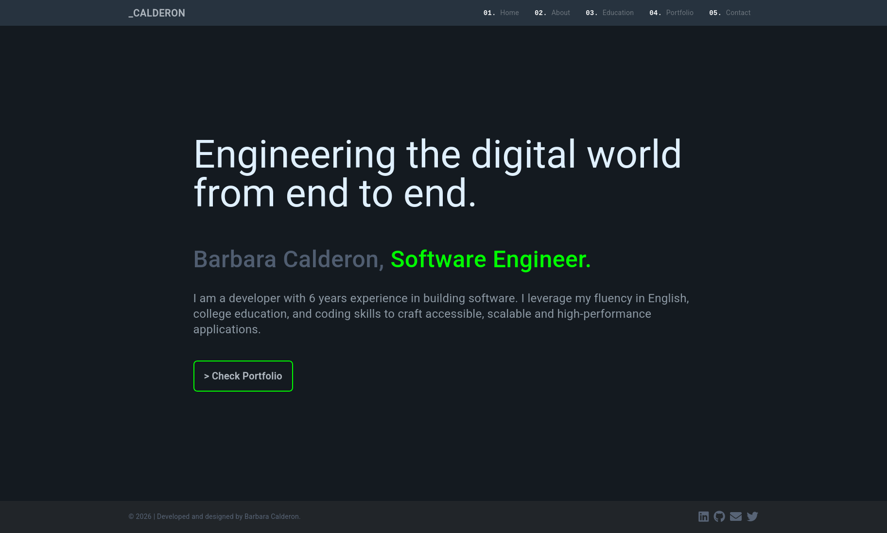

# BC | Angular Portfolio App

This is my personal portfolio website built with **Angular 19**, Typescript, HTML5, CSS3, Bootstrap, Bootstrap Icons, RxJS, Vite, Angular Material and tests in Jasmine. It's currently deployed on the web: [https://angular-portfolio-app-omega.vercel.app/](https://angular-portfolio-app-omega.vercel.app/)

This project was originally generated with [Angular CLI](https://github.com/angular/angular-cli) version 17.3.7 and then upgraded to version 19.2.7 on April 2025. Check [version history](#version-history) for more information.

_This project's last tag for Angular 17 was tag v1.3.0, you can download and use the portfolio in this version still._

## Author

I'm Barbara Calderon, a software developer.

- [Github](https://www.github.com/barbaracalderon)
- [Linkedin](https://www.linkedin.com/in/barbaracalderondev/?locale=en_US)
- [Twitter](https://www.x.com/bederoni)

## The Project

This portfolio is a **dynamic and responsive web application** built using **Angular**, showcasing my skills and projects as a software developer. The design and development of this portfolio aimed to provide a seamless user experience across different devices while highlighting various aspects of my professional journey. 

The potfolio has sections of home, about, education, portfolio projects and contact information. Key features are its dynamic content, the responsive design and modern aesthetics.

## Technologies Used

- **Angular 19** - Latest version with standalone components.
- **TypeScript 5.8** - Strongly typed JavaScript superset.
- **Angular Material 19** - Material Design components.
- **Bootstrap 5** - Responsive CSS framework.
- **Bootstrap Icons** - Clean SVG icons.
- **Swiper.js 11** - Modern touch slider.
- **Angular CLI 19** - Official build tooling.
- **RxJS 7** - Reactive programming library.
- **Vite** - Next-gen frontend tooling (via Angular CLI).
- **Jasmine 5** - Behavior-driven testing framework.
- **Karma 6** - Test runner for Angular.
- **Vercel** - Cloud platform for static sites.

## Development server

You can run this project locally too.

Clone this repo.

Run `ng serve` for a dev server. 

Navigate to `http://localhost:4200/`. 

The application will automatically reload if you change any of the source files.

## Code scaffolding

Run `ng generate component component-name` to generate a new component. You can also use `ng generate directive|pipe|service|class|guard|interface|enum|module`.

## Build

Run `ng build` to build the project. The build artifacts will be stored in the `dist/` directory.

## Test

Run `ng test` to test the project. This will launch the Karma test runner and execute all Jasmine test specs (`*.spec.ts` files).

## Further help

To get more help on the Angular CLI use `ng help` or go check out the [Angular CLI Overview and Command Reference](https://angular.io/cli) page.

## About

This portfolio was designed and developed by myself, Barbara Calderon, using frontend software skills for a dynamic and responsive web application.

## Version History

| Version | Date       | Description                                      |
|---------|------------|--------------------------------------------------|
| [2.0.0](https://github.com/barbaracalderon/angular-portfolio-app/releases/tag/v2.0.0)   | Apr 2025   | `!breaking changes` Upgrade Angular v17 to v19. Replace "accordion" with "expansion". Replace "carousel" with "swiper". Remove ngx-bootstrap lib. Refactor breaking code. Update tests with Jasmine framework.|
| [1.3.0](https://github.com/barbaracalderon/angular-portfolio-app/releases/tag/v1.3.0)   | Mar 2025   | Added "forecast-cli" project to portfolio.|
| [1.2.0](https://github.com/barbaracalderon/angular-portfolio-app/releases/tag/v1.2.0)   | Feb 2025   | Added 5 projects to portfolio. Resolved Vite overlay issue.|
| [1.1.1](https://github.com/barbaracalderon/angular-portfolio-app/releases/tag/v1.1.1)   | Jan 2025   | Updated content on about me page. Resolved issues with dependencies alerts by upgrading.|
| [1.1.0](https://github.com/barbaracalderon/angular-portfolio-app/releases/tag/v1.1.0)   | Jan 2025   | Updated content on home and about me pages. Fixed window width issues. Carousel anchor tags no longer green style. Resolved issue with carousel indicators not displaying. Added license.|
| 1.0.1   | Jun 2024   | Added more projects to the portfolio page.       |
| 1.0.0   | May 2024   | Initial release of the portfolio.                |
